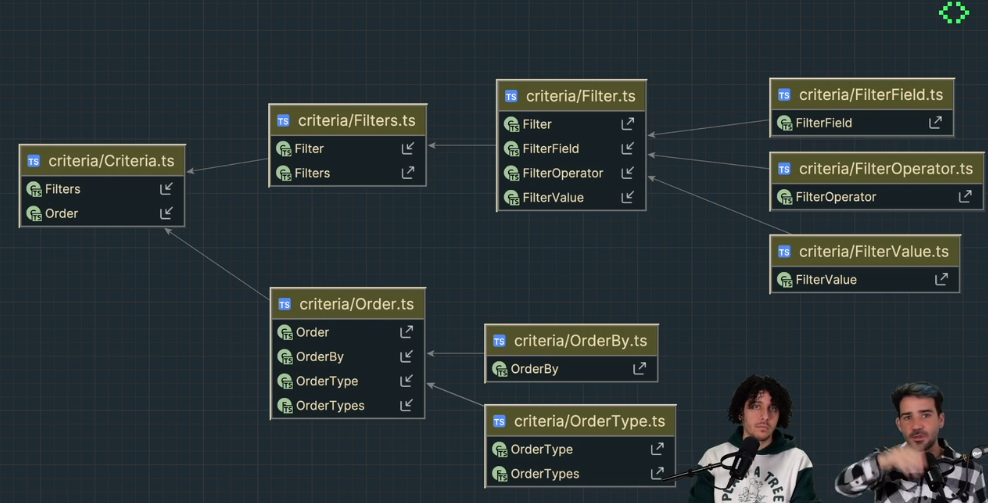

## Criteria Pattern
Este patron nos perimte crear filtros en nuestros repositorio para realizar busquedas complejas.
Considerar que por defecto todos los filtros se aplicaran con el operador `AND` 

